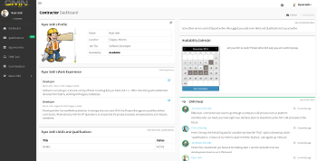
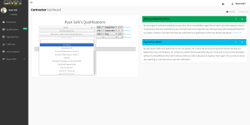
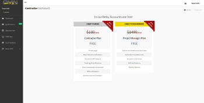
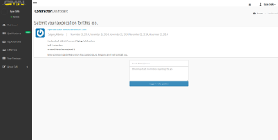
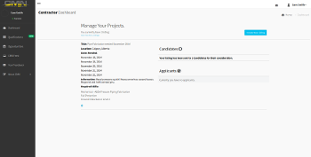
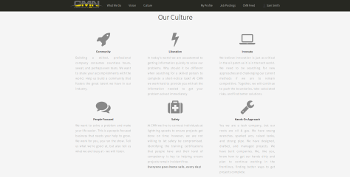

# Project: Contract Me Now

##### Type: WebApp

##### Role: Developer

### Software Functionality: 
- Algorithm which matched users based on job skills, availability, wage requirements and location.
- Ability for Project Manager to choose from a selection of candidates.
- Tracking of users credentials and certifications.
- Tracking of users previous work experience.
- Fully responsive layout with Bootstrap 3.
- User Profile pages with ability to post messages to the site.
- Manage page to select users for your jobs. 
- SMS and Email notifications (optional).
- Facebook and Google signin.

### Technologies Used:
- Ruby
- Rails
- RSpec
- Bootstrap 
- Jquery
- PostgreSQL
- CSS3
- HTML5
- Heroku
- Amazon Web Services (s3)
- Git
- Github
- Redis

### Rails Gems: 
- Sidekiq
- Devise
- Factory-girl
- Aws-sdk
- Faker
- Best-in-place
- Thin
- Paperclip
- Will-paginate
- Twilio-ruby

  

    

      <a href="cmn1.png">
        </img>
      </a>
    

    

      <a href="cmn2.png">
        </img>
      </a>
    

  

  

    

      <a href="cmn3.png">
        </img>
      </a>
    

    

      <a href="cmn4.png">
        </img>
      </a>
    

  

  

    

      <a href="cmn5.png">
        </img>
      </a>
    

    

      <a href="cmn6.png">
        </img>
      </a>
    

  

