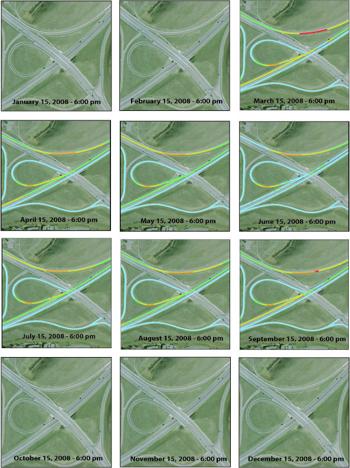

# Project: Sunglare

##### Type: Application

##### Role: Developer

### Software Functionality: 
- Interaction with NREL Solar Positioning Algorithm.
- Interaction with ArcGIS viewshed functionality.
- Input via CLI or Configuration files.
- Ability to predict Solar Hazards at certain time of day on a specific road.
- Output to CSV or directly to database.

#### Technologies Used:
- ArcGIS
- Grass
- Python
- C
- C++
- PostgreSQL
- PostGIS

  

    

      <a href="sg1.jpg">
        </img>
      </a>
    

  

   

## Write Up
  <strong><a href="Sun-Glare-Hazard.doc"> Word Format(.doc) </a></strong>
